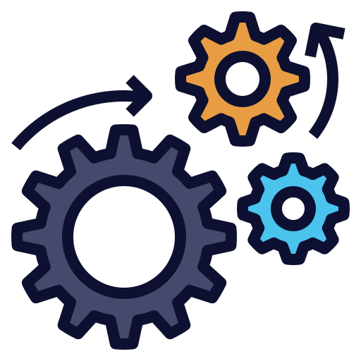
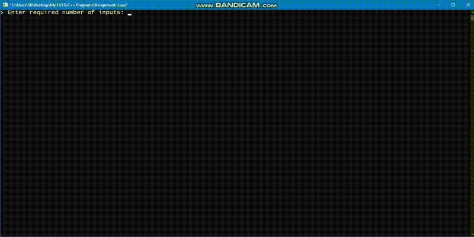

<h2 align="center">Rube's Goldberg Machine✅</h2>

<p align="center">
   
</p>

<p align="center">
  <a href="https://github.com/sandip2224/DSA-Assignment"><strong>Explore the docs »</strong></a>
</p>

<!-- PROJECT LOGO -->
  <p align="center">
    <br />
    <a href="https://github.com/sandip2224/DSA-Assignment">View Demo</a>
    ·
    <a href="https://github.com/sandip2224/DSA-Assignment/issues">Report Bug</a>
    ·
    <a href="https://github.com/sandip2224/DSA-Assignment/issues">Request Feature</a>
  </p>

<!-- TABLE OF CONTENTS -->
<h2 align="center">Table of Contents</h2>

- [About the Project](#about-the-project)
  - [Built With](#built-with)
  - [Preview](#preview)
- [Getting Started](#getting-started)
  - [Prerequisites](#prerequisites)
  - [Installation](#installation)
- [Contributors](#contributors)
- [License](#license)
- [Acknowledgements](#acknowledgements)


<!-- ABOUT THE PROJECT -->

<h2 align="center">About the Project</h2>


This program is built solely with C++14 and implements multiple data structures including stacks, queues, linked lists, binary tree and simple arrays. The entire output configuration is built on a command line terminal approach and works perfectly fine with multiple user inputs.


Here's why it's so awesome:  

* We get to see the power of working with multiple data structures in C++ 😉
* We get to interact and work with large-scale programs in an object oriented language ✅

**You may also suggest changes by forking this repository and creating a pull request or opening an issue.**  

A list of commonly used resources that I find helpful are listed in the acknowledgements.  


<!-- BUILT WITH -->  

<h2 align="center">Built With</h2>

 - [C++](https://www.w3schools.com/cpp/)

<h2 align="center">Preview</h2>

<p align="center"></p>

<!-- GETTING STARTED -->

<h2 align="center">Getting Started</h2>

To get a local copy up and running follow these simple example steps as mentioned under `Installation` section below. 


<!-- PREREQUISITES -->

<h2 align="center">Prerequisites</h2>

> You'll need working knowledge of `C++14` to understand and work with this project.


<!-- INSTALLATION -->
<h2 align="center">Installation</h2>

1. Fork and clone this repository using  

```
  git clone https://github.com/sandipan_2224/DSA-Assignment.git
  cd DSA-Assignment    
```  

2. Execute the `.cpp` program snippet on a C++ compatible code editor.  


<!-- LICENSE -->  

<h2 align="center">License</h2>

Distributed under the MIT License. See `LICENSE` for more information.  


<h2 align="center">Contributors</h2>

- [Sandipan Das](https://github.com/sandip2224)
- [Jayvardhan Rathi](https://github.com/ComputerScientist-01)
- [Sanskar Srivastava](https://github.com/sanskis)
- [Ashutosh Kumar](https://github.com/Ashu-tosh-Kr)


<!-- CONTRIBUTING -->

<h2 align="center">Contributing</h2>

Contributions are what make the open source community such an amazing place to be learn, inspire, and create. Any contributions you make are **greatly appreciated**.

1. Fork the Project
2. Create your Feature Branch (`git checkout -b feature/AmazingFeature`)
3. Commit your Changes (`git commit -m 'Add some AmazingFeature'`)
4. Push to the Branch (`git push origin feature/AmazingFeature`)
5. Open a Pull Request  


<!-- ACKNOWLEDGEMENTS -->

<h2 align="center">Acknowledgements</h2>

* [C++ docs](https://www.w3schools.com/cpp/)
* [Markdown docs](https://www.markdownguide.org/)

<h3 align="right">Built with :heart: by <em>Sandipan Das</em></h3>
